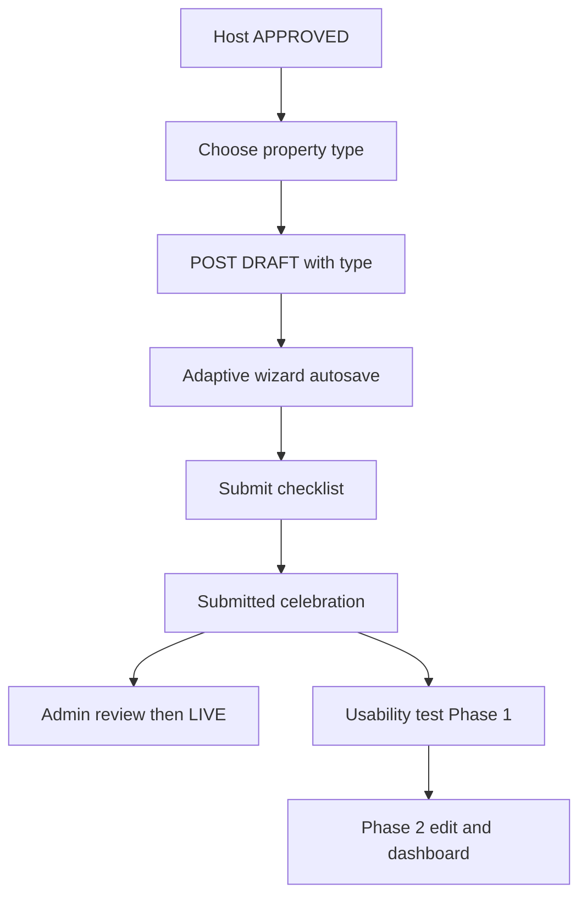

# Nexa Stays — Host Listing Flow

**Audience:** product / UX / engineering.  
**Scope:** Phase 1 “create early, refine over time” (web + `backend/stays`).  
**Related:** [`NEXA_STAYS_WEB_DESIGN.md`](./NEXA_STAYS_WEB_DESIGN.md) · [`ARCHITECTURE.md`](./ARCHITECTURE.md)

---

## 1. One-sentence summary

Approved hosts pick a **property type**, which immediately creates a server **`DRAFT`**. They refine via an adaptive wizard with autosave, then **submit** for admin review. Guests see the listing only after admin sets it **`LIVE`**.

---

## 2. Philosophy

create after type intent → save continuously → improve over time → submit. Trust and admin moderation stay.

---

## 3. Submission requirements matrix (single source of truth)

Shared by frontend validation, `POST .../submit`, QA, and this doc.

| Requirement | Required to submit | Recommended |
|-------------|:------------------:|:-----------:|
| Property type | ✓ | |
| Location (city, address, map pin) | ✓ | |
| Title | ✓ | |
| Description | ✓ | |
| Guest capacity | ✓ | |
| Price (listing nightly or room prices when hotel/hostel) | ✓ | |
| ≥ 5 photos | ✓ | |
| Room configuration (hotel / hostel / riad-rooms only) | ✓ when applicable | |
| Walkthrough video | | ✓ |
| 12 photos | | ✓ |
| Amenities | | ✓ |
| House Rules | | ✓ |

Hard requirements block submit. Recommended items feed Listing Complete % / quality nudges only.

---

## 4. Completion flags

**Do not** persist a single `completion_percentage` as source of truth.

Store/derive boolean flags, then compute % from weights (changeable without migrating rows):

| Flag | Meaning |
|------|---------|
| `location_complete` | City, address, lat/lng |
| `about_complete` | Title (not untitled), description ≥20 chars, max guests ≥1 |
| `pricing_complete` | Nightly or room prices &gt; 0 |
| `photos_complete` | ≥5 photos |
| `photos_quality_complete` | ≥12 photos (quality) |
| `rooms_complete` | True when N/A or unit types configured |
| `walkthrough_complete` | Walkthrough present |
| `amenities_complete` / `house_rules_complete` | Optional recommendations |

**Default weights:** Location 20% · About 20% · Pricing 20% · Photos (≥5) 30% · Walkthrough 5% · Optional cluster 5%.

Same flags power: dashboard progress, submit validation, missing checklist, listing quality, analytics.

Also store `last_edited_at` for draft lifecycle.

---

## 5. Listing lifecycle

| Status | Meaning | Who sets it |
|--------|---------|-------------|
| `DRAFT` | In progress; host editing | Host create (type-first) |
| `SUBMITTED` | Waiting for admin review | Host submit |
| `APPROVED` | Admin accepted; not yet public | Admin |
| `LIVE` | Visible on Explore | Admin set-live; host resume |
| `PAUSED` | Off market | Host pause |
| `REJECTED` | Internal; host UI shows **Needs Changes** | Admin |

### Draft lifecycle

- No edits for **30 days** → archived (`archived_at`)
- **90 days** inactive → deleted
- Any edit resets the clock via `last_edited_at`

(Cron can ship in Phase 1.5; fields are ready.)

---

## 6. API (host)

| Method | Path | Behavior |
|--------|------|----------|
| `POST` | `/stays/host/listings` | Require `listing_type` (+ optional `guest_house`) → **DRAFT**, no media |
| `PATCH` | `/stays/host/listings/:id` | Autosave fields; updates flags / `last_edited_at` |
| `PUT` | `/stays/host/listings/:id/media` | Replace media on DRAFT/editable |
| `PUT` | `/stays/host/listings/:id/unit-types` | Replace room inventory |
| `POST` | `/stays/host/listings/:id/submit` | Enforce requirements matrix → **SUBMITTED** |

Guest House UI maps to `APARTMENT` + `property_details.guest_house`.

---

## 7. Web wizard (Phase 1)

**Route:** `/{locale}/host/listings/new` (continue: `?draft=:id`)

1. Type picker → `POST` DRAFT → URL updates with `draft` id  
2. Steps: **Location → About (Basics + Details) → [Rooms if hotel/hostel] → Pricing → Photos workspace → Submit**  
3. Chrome shows **Listing Complete %** from flags (not only step N/M)  
4. Autosave via PATCH; media/units synced on step leave / save / submit  
5. Submit → celebration (1–2 business days) → dashboard  

**Source of truth:** server DRAFT. localStorage is not SoT.

Photos: ≥5 required; 12 recommended; walkthrough = “Boost your approval chances.”

---

## 8. LIVE edit policy

| Change | Review? |
|--------|---------|
| Description, price, photos, amenities, house rules | Immediate |
| Capacity | Immediate (Phase 1) |
| Location / geo / address | **Blocked** on LIVE (moderation in Phase 2) |
| Property type | **Not allowed** |

---

## 9. Dashboard (Phase 2 starters)

- Whole DRAFT / Needs Changes card opens continue wizard  
- Completion % + missing required items  
- SUBMITTED shows 1–2 business day ETA  
- Host-facing **Needs Changes** + **Fix & Resubmit** (internal `REJECTED`)  
- Edit: safe fields; location locked when live; house rules / amenities editable  

---

## 10. Phase 1 usability gate (before Phase 2 expansion)

After Phase 1 ships, watch **5–10 real hosts** (or Clarity / Hotjar). Measure:

| Metric | Why |
|--------|-----|
| Completion rate | Draft → submit |
| Time to first draft | Type → DRAFT created |
| Time to submission | DRAFT → SUBMITTED |
| Abandon points | Which step drops off |
| Confusing fields | Qualitative notes |

**Phase 2 is driven by those observations**, not more design debate.

Planned Phase 2 (not locked in detail): Listing Quality recommendations, richer media/rooms edit, location moderation for LIVE.

---

## 11. Out of scope

- Self-publish without admin  
- Separate apartment/hotel codebases  
- First-class `GUEST_HOUSE` explore enum  
- Mobile parity  

---

## 12. Phase 1 success criteria

- No DRAFT until type chosen  
- Flags + weighted %; requirements matrix is SoT for submit  
- About Basics + Details; type-aware pricing; photo workspace  
- Submit celebration; 5 photos enough; walkthrough recommended only  
- Admin approval retained  
- Hosts see Needs Changes, not “Rejected,” in host UI  
