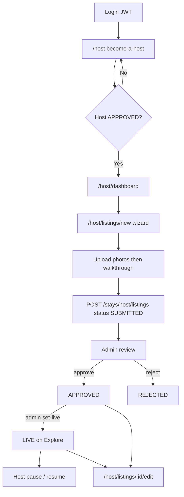

# Nexa Stays — Host Listing Flow (Exact Step-by-Step)

**Audience:** product / UX / engineering experts reviewing how hosts create and publish listings.  
**Scope:** current production behavior of `nexastays_web` + `backend/stays` (as implemented).  
**Goal of this doc:** describe the flow accurately so we can improve it—not propose a redesign here.

Canonical copy (monorepo): [`docs/LISTING_FLOW.md`](../../docs/LISTING_FLOW.md)  
Related: [`NEXA_STAYS_WEB_DESIGN.md`](./NEXA_STAYS_WEB_DESIGN.md) · [monorepo `docs/ARCHITECTURE.md`](../../docs/ARCHITECTURE.md)

---

## 1. One-sentence summary

A logged-in user must become an **approved host**, then complete a **multi-step listing wizard** that uploads media and **creates the listing as `SUBMITTED`**. The listing becomes guest-visible only after an **admin** approves it and sets it **`LIVE`**. Hosts cannot self-publish.

---

## 2. End-to-end lifecycle

### Listing status enum

| Status | Meaning | Who sets it |
|--------|---------|-------------|
| `DRAFT` | Entity default only | **Not used** by the create API today |
| `SUBMITTED` | Waiting for admin review | Host create |
| `APPROVED` | Admin accepted; not yet public | Admin |
| `LIVE` | Visible to guests on Explore | Admin (`set-live`); also host resume |
| `PAUSED` | Temporarily off market | Host pause |
| `REJECTED` | Admin rejected | Admin |

There is **no host “publish” button**. Create = submit for review.

---

## 3. Phase A — Become a host (prerequisite)

**Route:** `/{locale}/host`  
**File:** `nexastays_web/app/[locale]/host/page.tsx`

Hosts cannot open the listing wizard until host verification/application is **`APPROVED`**.

### A1. Entry

1. User must be authenticated (`ProtectedRoute` / JWT).
2. Nav may hide “Become a Host” when host status is already `PENDING` or `APPROVED` (`getHostMe`).

### A2. Onboarding UI (4 steps)

| Step | What the host does |
|------|--------------------|
| 1 | Choose host type (apartment / hotel / hostel-style UI mapping) |
| 2 | Account / legal name, confirm email, accept terms |
| 3 | SMS OTP (`sendOtp` / `verifyOtp`) |
| 4 | Identity: reuse existing KYC **or** upload ID front + back + selfie → `submitHostVerification` |

### A3. After submit

- Status becomes **`PENDING`** until an admin approves the host.
- Approved hosts are redirected / guided to **`/host/dashboard`**.
- Pending UI waits; “add listing” is only useful once approved.

### A4. APIs involved

| Client helper | HTTP |
|---------------|------|
| `getHostVerification` | `GET /stays/host/verification` |
| `submitHostVerification` | `POST /stays/host/verification` |
| Document uploads | `POST /stays/host/verification/documents/{front\|back\|selfie}` |
| `getHostMe` | `GET /stays/host/me` |

**Note:** `submitHostOnboarding` exists in the API client but the **web become-host page uses verification**, not that onboarding endpoint.

### A5. Backend gate for listing create

On `POST /stays/host/listings`, the service checks `HostsService.canList` (approved host). A stricter helper also considers verification + `listing_frozen`; see §8 for inconsistencies experts should review.

---

## 4. Phase B — Host dashboard

**Route:** `/{locale}/host/dashboard`  
**File:** `nexastays_web/app/[locale]/host/dashboard/page.tsx`

### What hosts see

- List of their listings with status coloring (`LIVE` / `APPROVED` green, `PAUSED` orange, `SUBMITTED` amber).
- Actions: **Add listing**, **Edit**, **Pause** (if LIVE/APPROVED), **Resume** (if PAUSED).
- Pending (`SUBMITTED`) listings are not guest-public; UI frames them as under review.

### APIs

| Action | HTTP |
|--------|------|
| List | `GET /stays/host/listings` |
| Pause | `POST /stays/host/listings/:id/pause` |
| Resume | `POST /stays/host/listings/:id/resume` |

**Gap:** There is no dedicated `/host/listings` index route (nav highlighting may treat “listings” as dashboard).

---

## 5. Phase C — Create listing wizard (exact steps)

**Route:** `/{locale}/host/listings/new`  
**Shell:** `components/host/listing-wizard/ListingWizardShell.tsx`  
**Step UI:** `components/host/listing-wizard/WizardStepBody.tsx`  
**Engine:** `lib/host-listing-wizard/` (`step-config.ts`, `validators.ts`, `map-to-api.ts`, `form-types.ts`)

### C0. Entry gate

1. Page loads `getHostVerification`.
2. If status ≠ `APPROVED`, wizard is blocked; CTA back to `/host`.
3. **`getHostMe` / `can_create_listing` is not checked on this page** (only verification APPROVED).

### C1. Local draft (not server draft)

- Autosave / “Save draft” writes to **`localStorage`**: `nexa_listing_wizard_draft_{userId}`.
- **Files are stripped** from the draft. Photos and walkthrough are **lost on restore**; host must re-upload.
- There is **no** `POST` that creates a server-side `DRAFT` listing from the web app.

### C2. Dynamic step sequence

Base order:

1. `propertyType`
2. `bookingModel`
3. `location`
4. `details`
5. `unitTypes` — **only when required** (see matrix below)
6. `amenities`
7. `policies`
8. `pricing`
9. `media`
10. `review`

Sidebar allows jumping **backward** only. Changing property type mid-flow can reset units/details (confirm dialog) and jump to step 0.

### C3. Property type × booking model matrix

| Listing type | Booking models offered | `unitTypes` step |
|--------------|------------------------|------------------|
| `APARTMENT` / `VILLA` | `ENTIRE_PROPERTY`, `PRIVATE_ROOM`, `MULTI_UNIT` | If `MULTI_UNIT` |
| `RIAD` | `ENTIRE_PROPERTY`, `ROOM_TYPES`, `BOTH` | If `ROOM_TYPES` or `BOTH` |
| `HOTEL` | `ROOM_TYPES` only | Always |
| `HOSTEL` | `DORM_BEDS`, `PRIVATE_ROOMS`, `DORM_AND_PRIVATE` | Always |

### C4. What each step collects

#### Step 1 — Property type

Host picks one of: Apartment, Villa, Riad, Hotel, Hostel.

#### Step 2 — Booking model / structure

How the property is sold (entire place, private room, multi-unit, room types, dorms, etc.).

#### Step 3 — Location

Required (client validation):

- Title
- City
- Address
- Country (2-letter code)
- Map pin: `geoLat` / `geoLng` (`HostLocationMapPicker`)

#### Step 4 — Details

- Description (≥ 20 characters)
- Max guests (≥ 1)
- Plus type-specific property detail fields as implemented in the wizard

#### Step 5 — Unit types (conditional)

When shown: at least one unit; each needs a **name** and **base price > 0** (and quantity / amenities per unit as UI allows).

If omitted on API create, backend may invent a **default single unit** from listing type + rate plan.

#### Step 6 — Amenities

Optional on the client (`validateStep` does not require amenities). Stored on listing rules (and optionally per unit).

#### Step 7 — Policies / contact

Required:

- Contact name
- Phone (digits / `+` / `-` / `()` / spaces)

Also: house rules (pets, smoking, cancellation, quiet hours, etc.) as offered in UI.

#### Step 8 — Pricing

- Listing-level `basePrice > 0`, **or** valid per-unit prices when multi-unit.
- Currency defaults toward **MAD** on the backend.
- Optional weekend / cleaning / deposit fields depending on the form.

#### Step 9 — Media (hard gate)

Client rules before submit:

| Rule | Requirement |
|------|-------------|
| Photos | **≥ 12** images |
| Categories | ≥ 1 photo categorized **EXTERIOR** or **ENTRANCE** |
| Walkthrough | **Required** video (`video/*`) |
| UX guidance | Progress UI: 12 minimum / 15 recommended |
| Defaults | New photos default category `OTHER`; first photo often cover |

Backend on create:

- `media.length >= 12` (counts **all** media rows, including walkthrough)
- ≥ 1 item with `kind === WALKTHROUGH`
- Each `asset_id` must exist under `uploads/host/{userId}/listing/`

Upload limits (service): photos ~**5MB** (JPEG/PNG/WebP); walkthrough ~**100MB** (MP4/MOV/WebM).

#### Step 10 — Review

Summary screen; re-runs validation across steps on submit.

### C5. Submit sequence (exact order)

Implemented in create page `handleSubmit`:

1. Validate all wizard steps.
2. For each photo file: `uploadListingPhoto(file)` → `{ asset_id }`.
3. Upload walkthrough: `uploadListingWalkthrough(file)` → `{ asset_id }`.
4. Build body via `buildCreateHostListingBody` (`map-to-api.ts`).
5. `createHostListing(body)` → listing created with status **`SUBMITTED`**.
6. Clear local draft; show success → dashboard.

Uploads are **sequential**. There is no resumable upload UI / retry-per-file UX beyond overall submit error handling.

### C6. Create API payload (high level)

`POST /stays/host/listings` includes roughly:

- Core: title, listing_type, booking_model, city, address, geo, description, …
- `rules` (amenities, pets, smoking, max_guests, cancellation, …)
- `rate_plan` (base_price, currency, optional fees)
- `check_in_contact` (name, phone, role)
- `media[]` `{ asset_id, kind: PHOTO|WALKTHROUGH, sort_order, category?, is_cover? }`
- Optional `unit_types[]`
- Optional policies / safety / property_details JSON
- Optional `instant_booking` (default false)

Backend create also writes related rows: listing, rules, rate plan, check-in contact, unit types, media.

---

## 6. Phase D — Admin review → public LIVE

Hosts do **not** control these steps.

| Step | Admin API | Transition |
|------|-----------|------------|
| Approve | `POST /admin/stays/listings/:id/approve` | `SUBMITTED` → `APPROVED` |
| Reject | `POST /admin/stays/listings/:id/reject` | `SUBMITTED` → `REJECTED` (reason audited) |
| Publish | `POST /admin/stays/listings/:id/set-live` | `APPROVED` → `LIVE` (+ `LISTING_PUBLISHED` event) |

Guest Explore / public listing detail only show **`LIVE`** listings.  
Public media: `GET /stays/listings/:id/media/:assetId` is **LIVE-only**. Admins can fetch media for review regardless.

### After LIVE

| Host action | Behavior |
|-------------|----------|
| Pause | `LIVE` or `APPROVED` → `PAUSED` |
| Resume | `PAUSED` → **`LIVE`** (does not restore `APPROVED`) |
| Edit | Flat form (see §7) |
| Availability blocks | `POST /stays/host/listings/:id/availability-blocks` (calendar blocks; **not** part of create wizard) |

---

## 7. Phase E — Edit listing (post-create)

**Route:** `/{locale}/host/listings/[id]/edit`  
**File:** `nexastays_web/app/[locale]/host/listings/[id]/edit/page.tsx`

### What edit supports

Single flat form (not the create wizard): basics, map, pricing, rules, amenities, contact.

Client validation (edit): title, city, address, map pin, description ≥ 20, price > 0, maxGuests ≥ 1, contact name/phone.

`PATCH /stays/host/listings/:id` allowed when status ∈ `DRAFT | SUBMITTED | APPROVED | LIVE | PAUSED` (not `REJECTED`).

### What edit does **not** support

- Add / replace / reorder **photos or walkthrough**
- Change **unit types** / inventory structure
- Change **booking model**
- Change status, country, and several advanced JSON blobs (per backend update rules)

UI surfaces a note that media cannot be changed on the edit page.

**Implication:** Hotel/hostel/multi-unit listings created in the rich wizard cannot be fully maintained in edit. Media mistakes require a process outside this UI today.

---

## 8. Known gaps and friction (for experts)

These are factual product/engineering debt points observed in the current implementation—useful starting points for improvement:

1. **No server-side draft** — only localStorage; media never survives draft restore.
2. **Host cannot self-publish** — expected for trust, but UX has little ETA / review-state detail beyond `SUBMITTED`.
3. **No host resubmit path from `REJECTED`** — rejected listings are not editable via normal update statuses.
4. **Create vs edit asymmetry** — wizard is rich; edit is thin (no media, units, booking model).
5. **Sequential media upload** — slow/fragile for 12+ photos + video; no per-file retry UI.
6. **Photo category default `OTHER`** — hosts often fail EXTERIOR/ENTRANCE validation late.
7. **Frontend vs backend media counting** — FE requires 12 photos + walkthrough; BE requires ≥12 media items including walkthrough (stricter FE is OK, but messaging can confuse).
8. **Gate mismatch risk** — create page checks verification `APPROVED`; backend `canList` / freeze / `getHostMe.can_create_listing` may not be fully aligned.
9. **Dual onboarding APIs** — web uses verification; `submitHostOnboarding` unused by pages.
10. **Legacy wizard constants / i18n** — older 8-step constants/copy may not match dynamic steps.
11. **Property type change resets work** — easy to lose unit/details progress.
12. **Availability is afterthought** — calendar blocks are a separate post-create API, not in the wizard.
13. **Resume always → LIVE** — even if the listing was paused from `APPROVED` before going live.
14. **Missing `/host/listings` index** — navigation/IA inconsistency.

---

## 9. Key file map

### Web (`nexastays_web`)

| Path | Role |
|------|------|
| `app/[locale]/host/page.tsx` | Become-a-host |
| `app/[locale]/host/dashboard/page.tsx` | Host hub |
| `app/[locale]/host/listings/new/page.tsx` | Create wizard + submit |
| `app/[locale]/host/listings/[id]/edit/page.tsx` | Edit |
| `components/host/listing-wizard/*` | Wizard shell / steps / map |
| `lib/host-listing-wizard/*` | Steps, validation, API mapping |
| `lib/stays-api.ts` | HTTP client |
| `lib/stays-types.ts` | Shared types / statuses |
| `lib/host-listing-constants.ts` | Amenities / legacy step leftovers |

### Backend (`backend/stays`)

| Path | Role |
|------|------|
| `src/modules/stays/stays.controller.ts` | Host listing + media routes |
| `src/modules/stays/services/host-listings.service.ts` | Create / update / pause / resume / media |
| `src/modules/stays/dto/create-host-listing.dto.ts` | Create validation |
| `src/modules/stays/dto/update-host-listing.dto.ts` | Update validation |
| `src/modules/stays/entities/stays-listing.entity.ts` | Status model |
| `src/modules/admin/admin-stays.controller.ts` | Approve / reject / set-live |
| `src/modules/admin/admin-stays.service.ts` | Admin transitions |
| `src/modules/stays/hosts/hosts.service.ts` | `canList` used on create |
| `src/modules/stays/hosts/host-onboarding.service.ts` | Host approval / freeze flags |

---

## 10. Suggested reading order for an expert review

1. Walk the UI: `/host` → dashboard → `/host/listings/new` → submit → dashboard pending.
2. Read §5 (wizard) and §8 (gaps) in this doc.
3. Trace `createListing` in `host-listings.service.ts` and admin `approveListing` / `setListingLive`.
4. Compare create wizard fields vs edit page + `UpdateHostListingDto` (asymmetry).
5. Decide target improvements: server drafts, media management, publish UX, rejection/resubmit, edit parity, verification gates.

---

*Document reflects the codebase as of the listing-flow audit for expert improvement. Update this file when the create/edit/admin publish paths change.*
